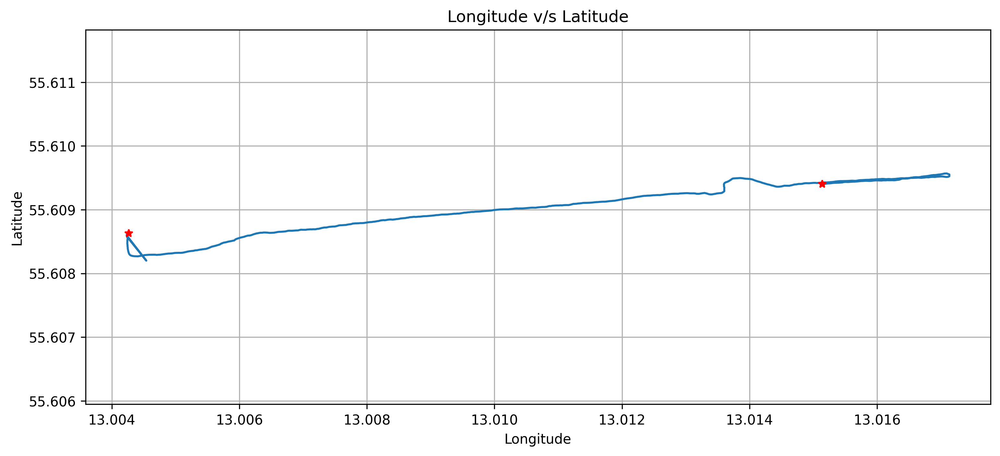
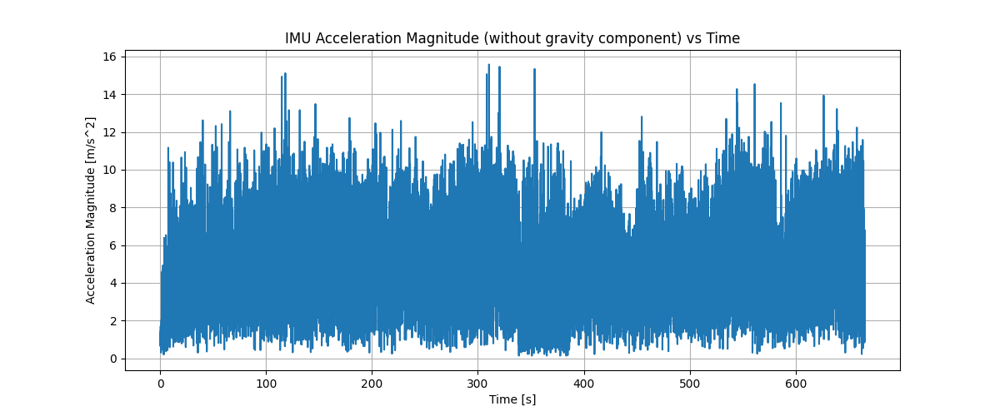
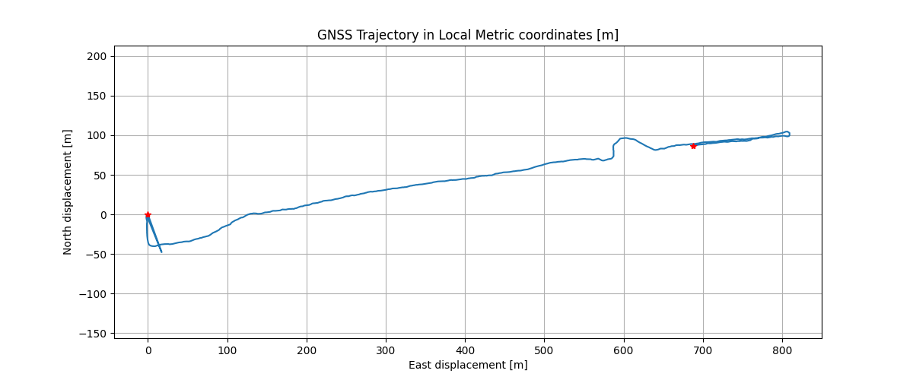
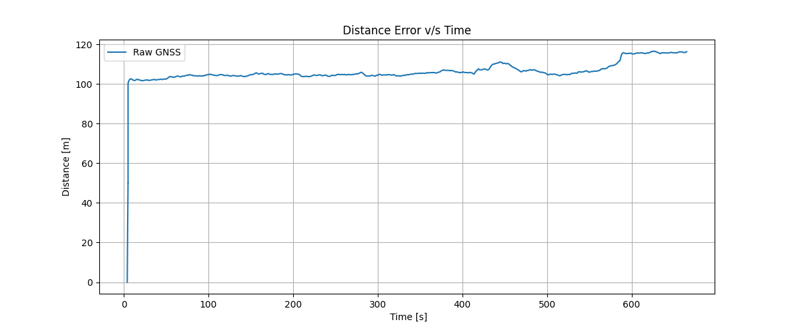
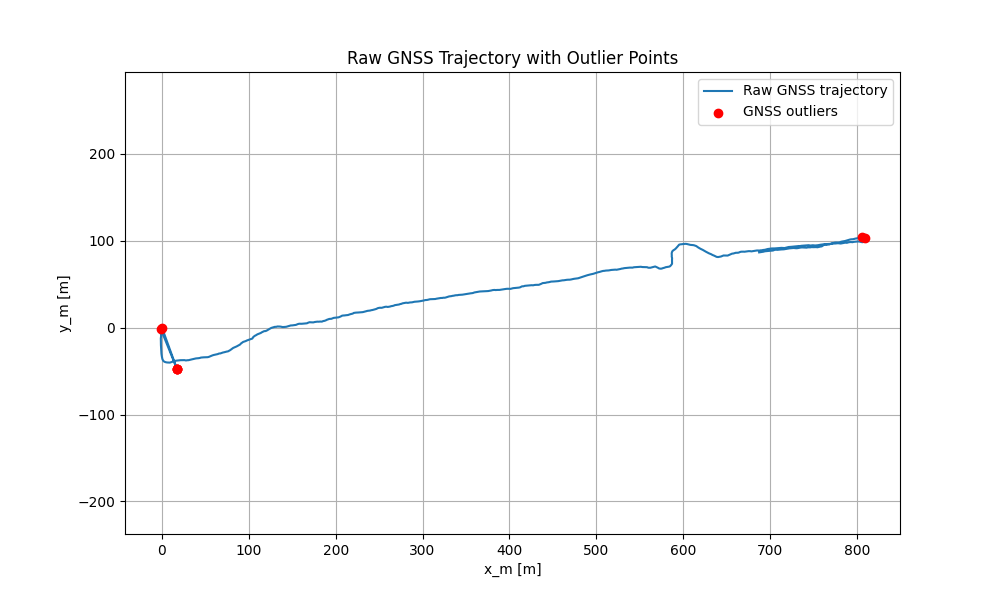
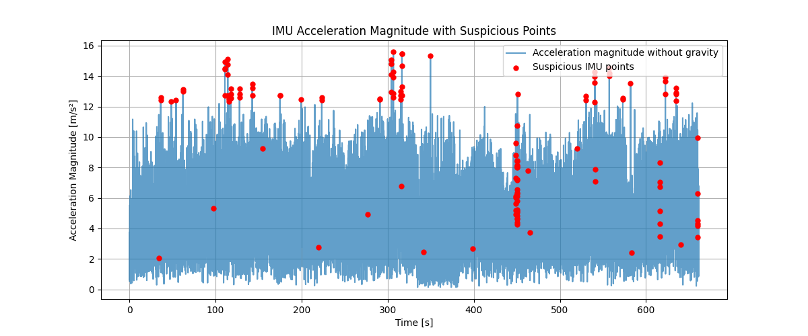

# GNSS-IMU-WALKING-TRAJECTORY-FUSION
A preprocessing and Kalman-filter-based trajectory estimation pipeline for smartphone walking data

# Project Overview:
This project develops a GNSS–IMU preprocessing and trajectory-estimation pipeline for smartphone-based walking data. The main goal is to analyze the reliability of raw mobility signals, identify sensor-related issues, and prepare the data for robust trajectory estimation and digital biomarker analysis.

The pipeline uses GNSS position data, IMU acceleration and gyroscope signals. The raw GNSS data is converted into local metric coordinates, compared against reference walking distance, and analyzed for position jumps, unrealistic movement, and confidence-related errors. Candidate GNSS outliers are detected using physically interpretable criteria such as step distance, computed speed, GNSS-reported speed, and confidence interval. 
In parallel, the IMU signals are inspected for acceleration patterns, gyroscope activity, timing gaps, phone-orientation effects, and suspicious high-motion regions. Instead of blindly deleting unreliable measurements, the project keeps raw sensor data intact and creates quality flags that can later be used to skip or down-weight unreliable updates during filtering.

Finally, the project implements a first-stage Kalman-filter-based trajectory estimation prototype using a constant-velocity motion model and valid GNSS position updates. This prototype demonstrates how GNSS quality control can be integrated into a sensor-fusion pipeline and provides a foundation for future EKF-based GNSS/IMU fusion using orientation-corrected acceleration and adaptive noise modeling.

# Motivation
Reliable walking trajectory estimation is an important step before extracting meaningful mobility-based features from smartphone sensor data. Applications such as digital biomarker analysis, mobility monitoring, and early cognitive-decline research often depend on accurate information about how a person moves through space, including walking distance, speed changes, pauses, turns, and trajectory smoothness.

However, raw smartphone sensor data is often noisy and unreliable. GNSS measurements can contain position jumps, high uncertainty, missing speed or heading values, and cumulative distance errors. In this project, the raw GNSS trajectory showed that even a short early position jump can significantly inflate the total estimated walking distance compared with the reference distance.

The motivation of this project is to build a structured preprocessing and quality-control pipeline that identifies these issues before trajectory estimation. By detecting unreliable GNSS measurements, analyzing IMU signal behavior, and using a Kalman-filter-based trajectory estimation prototype, this project demonstrates how smartphone GNSS/IMU data can be prepared for more reliable mobility analysis and future EKF-based sensor fusion.

# Dataset
This project uses the “An Inertial and Positioning Dataset for the Walking Activity” dataset, which contains smartphone-based GNSS, IMU, orientation, step, and reference-distance recordings for walking activity analysis.
Link: https://datadryad.org/dataset/doi%3A10.5061/dryad.n2z34tn5q

For this project, I selected Subject 14, Track 14_3 as the main baseline track because it contains GNSS, IMU, orientation, step, and continuous reference-distance data. The raw dataset is not included in this repository; please download it from the original source and place it inside the data/ directory before running the notebook.

#Project Pipeline

# 1. Dataset Inspection and Track Filtering
The first stage inspects the metadata file to identify tracks that contain the required sensor streams. Tracks are filtered based on the availability of GNSS data, IMU/motion data, and minimul distance between reference distance and observed distance.

# 2. Track Selection
From the filtered candidates, Subject 14, Track 14_3 was selected as the baseline track. This track contains GNSS, IMU, orientation, step, and continuous reference-distance data. It also has a small difference between reference distance and app-measured distance, making it a good starting point for building and validating the preprocessing pipeline.
| Subject | TestID | Test Name | Reference Distance [m] |
|---:|---:|---|---:|
| 14 | 3 | 14_3 | 1011 |
| 14 | 2 | 14_2 | 1001 |
| 14 | 1 | 14_1 | 1005 |
| 14 | 0 | 14_0 | 1000 |
| 14 | 4 | 14_4 | 1002 |

# 3. Raw GNSS Exploration
The GNSS data is first visualized in its raw form using latitude and longitude. Speed, heading, and confidence interval are also inspected to understand signal quality and identify suspicious regions.

This stage helps reveal issues such as GNSS initialization noise, sudden position jumps, unrealistic speed spikes, and changes in reported GNSS uncertainty.

# 4. Raw IMU and Orientation Exploration

The IMU signals are inspected using acceleration, acceleration magnitude, gyroscope rotation rates, gyroscope magnitude, and orientation angles. This helps understand how the phone motion, hand movement, and device orientation affect the raw sensor readings.

The goal is to show that IMU data contains useful high-frequency walking motion, but it is also affected by noise, phone orientation, and hand-held motion.

# 5. Time Alignment and Sensor Preparation

All sensor streams are trimmed to the official walking interval using the test start and end timestamps. A normalized time axis is created so that all streams start from the same reference time. GNSS, IMU, orientation, step, and reference-distance data are then prepared for comparison.

This stage ensures that all sensors are temporally consistent before performing trajectory comparison or filtering.

# 6. GNSS Coordinate Conversion

GNSS latitude and longitude are converted into local metric coordinates using the first GNSS point as the local origin. This produces east/north displacement values in meters, allowing proper trajectory visualization and distance computation.

The converted trajectory is used to compute GNSS step distance, cumulative distance, and GNSS-derived speed.

# 7. Reference Distance Alignment
The continuous reference distance is interpolated onto the GNSS timestamps. This allows the GNSS cumulative distance and the reference distance to be compared at the same time points. This stage is important because GNSS and reference-distance timestamps do not exactly match.

8. GNSS Outlier Detection

Candidate GNSS outliers are detected using physically interpretable and quality-based criteria:

large GNSS step distance,
high computed speed,
high GNSS-reported speed,
high confidence interval,
missing or unreliable GNSS motion indicators.

Instead of deleting suspicious measurements, the pipeline assigns a gnss_outlier flag. This allows unreliable GNSS points to be skipped or down-weighted later during filtering.

# 9. Kalman Filter Trajectory Estimation
A first-stage Kalman Filter prototype is implemented using a constant-velocity motion model. The filter estimates the trajectory state:

[x, y, vx, vy]

where x and y are local metric positions and vx, vy are velocities.

GNSS provides position updates through:

z = [x_gnss, y_gnss]

GNSS measurements marked as outliers are skipped during correction. This demonstrates how GNSS quality flags can be integrated into a filtering pipeline.

